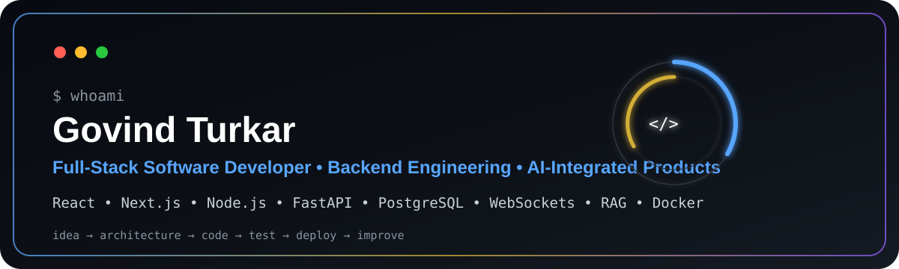
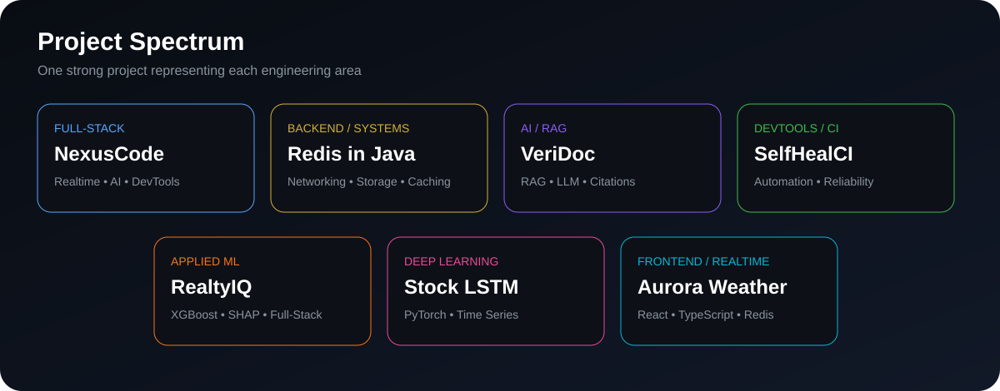
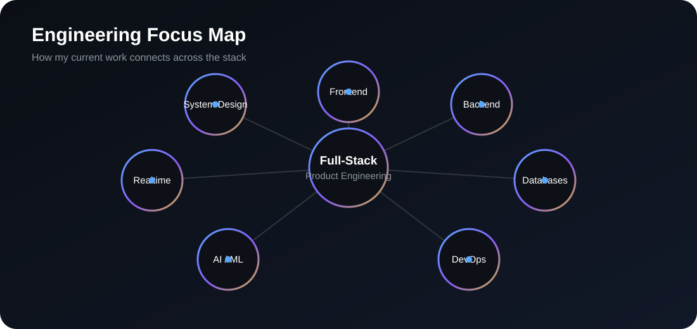

 

  

👨‍💻 Developer Profile

I'm Govind Turkar, a final-year B.Tech Computer Science & Engineering student and Full Stack Developer Intern at KodeKalp Global Technologies.

I build complete software products — from frontend interfaces and backend APIs to databases, authentication, realtime systems, AI integrations, automation, containerization, and deployment.

What I focus on

🚀 Full-Stack Product Engineering

⚙️ Backend Architecture & REST APIs

🗄️ Database Design, Caching & Persistence

⚡ Realtime Systems & WebSockets

🔐 Authentication & Application Security

🤖 RAG, LLMs, AI Agents & Applied ML

🐳 Docker & Production Deployment

🧠 System Design & Software Architecture

 

⚡ Technology Stack

Languages

Frontend

Backend

Databases & Caching

AI / ML

DevOps & Tools

  

🌟 Flagship Project — NexusCode

 

  

What it demonstrates

Browser-based Monaco code editor

Kanban project management

Realtime WebSocket collaboration

Gemini-powered AI assistant

PostgreSQL persistence

Authentication and protected workflows

Dockerized backend architecture

Full-stack integration from UI to deployment

Architecture

React / Vite
     │
     ├── Dashboard
     ├── Kanban
     ├── Monaco Editor
     └── Collaboration
     │
REST + WebSockets
     │
FastAPI
     ├── Authentication
     ├── Projects
     ├── Workspace APIs
     ├── Realtime
     └── AI Integration
     │
     ├──────────────┐
PostgreSQL      Gemini API
     │
   Docker

🧭 Project Spectrum

🌐 Full-Stack Engineering

<table>
<tr>
<td width="50%" valign="top">

🏠 RealtyIQ

ML-Powered Real Estate Analytics Platform

Next.js frontend

FastAPI + Express services

MongoDB

JWT authentication

XGBoost prediction

SHAP explainability

Next.js FastAPI MongoDB XGBoost SHAP

View Repository →

</td>
<td width="50%" valign="top">

🌦️ Aurora Weather

Realtime Weather Platform

React + TypeScript

Node.js / Express

Redis caching

AQI monitoring

Weather API integration

Responsive animated UI

React TypeScript Node.js Redis

View Repository →

</td>
</tr>
<tr>
<td width="50%" valign="top">

👥 TalentAI

AI-Powered Recruitment Platform

Candidate management, recruitment workflows, analytics, and AI-assisted hiring.

Full Stack AI Analytics

View Repository →

</td>
<td width="50%" valign="top">

🎓 Placement Analytics

Placement Management & Analytics

Student, company, placement, authentication, reporting, and analytics workflows.

Python Flask MySQL Analytics

View Repository →

</td>
</tr>
</table>

⚙️ Backend & Systems Engineering

<table>
<tr>
<td width="50%" valign="top">

🧱 Build Your Own Redis

In-Memory Key-Value Database in Java

TCP networking

In-memory storage

Key-value architecture

Data structures

Caching concepts

Backend internals

Java Networking Systems

View Repository →

</td>
<td width="50%" valign="top">

🛠️ SelfHealCI

Self-Healing CI & Developer Automation

CI/CD automation

Failure analysis

Automated recovery

Reliability engineering

Developer tooling

CI/CD Automation DevTools

View Repository →

</td>
</tr>
<tr>
<td width="50%" valign="top">

🔌 Product Store API

REST backend project focused on API architecture and CRUD service design.

View Repository →

</td>
<td width="50%" valign="top">

🔄 Cross-Stack CRUD

Engineering experiment comparing CRUD implementations across multiple stacks.

View Repository →

</td>
</tr>
</table>

🤖 AI, RAG & Agent Engineering

<table>
<tr>
<td width="50%" valign="top">

📄 VeriDoc

Citation-Grounded RAG Assistant

Retrieval-Augmented Generation

Document retrieval

LLM-powered Q&A

Citation grounding

Python RAG LLMs

View Repository →

</td>
<td width="50%" valign="top">

🤖 LearnAgent

AI Agent Experimentation

Exploring agent workflows, intelligent automation, and LLM-driven software behavior.

Python LLMs AI Agents

View Repository →

</td>
</tr>
<tr>
<td width="50%" valign="top">

🧠 Spatial Craft AI

Applied AI Engineering

Intelligent workflows and practical AI integration in modern software.

View Repository →

</td>
<td width="50%" valign="top">

👥 TalentAI

AI-Integrated Recruitment

Full-stack recruitment workflows with analytics and AI-assisted features.

View Repository →

</td>
</tr>
</table>

📈 Machine Learning & Deep Learning

<table>
<tr>
<td width="50%" valign="top">

🏠 RealtyIQ

Applied Machine Learning

XGBoost prediction, feature engineering, SHAP explainability, and model-serving APIs.

</td>
<td width="50%" valign="top">

📈 Stock Price LSTM

Deep-Learning Time-Series Pipeline

PyTorch LSTM

Leakage-aware features

Log-return targets

Walk-forward evaluation

Python PyTorch Streamlit

View Repository →

</td>
</tr>
</table>

🎨 Frontend Engineering

<table>
<tr>
<td width="50%" valign="top">

🌦️ Aurora Weather

Interactive Realtime UI

Modern animated frontend backed by live weather and environmental data.

</td>
<td width="50%" valign="top">

✍️ My Blog App

Modern Next.js Application

App Router, Server Components, Server Actions, search, filtering, and SEO.

View Repository →

</td>
</tr>
</table>

<b>✨ More Frontend Work</b>

 

🦷 Denteex Landing Page

Responsive modern landing-page implementation.

View Repository →

🧠 Engineering Focus

🏆 Trophy Cabinet

  

📊 Contribution & GitHub Activity

📈 GitHub Analytics

<table>
<tr>
<td width="50%" align="center" valign="middle">

</td>
<td width="50%" align="center" valign="middle">

</td>
</tr>
</table>

🔥 Contribution Streak

🐍 Contribution Snake

<picture>
<source media="(prefers-color-scheme: dark)" srcset="https://raw.githubusercontent.com/govindturkar69-crypto/govindturkar69-crypto/output/github-contribution-grid-snake-dark.svg"/>
<source media="(prefers-color-scheme: light)" srcset="https://raw.githubusercontent.com/govindturkar69-crypto/govindturkar69-crypto/output/github-contribution-grid-snake.svg"/>

</picture>

🎯 Current Focus

<table>
<tr>
<td width="50%" valign="top">

🔨 Building

Production-grade applications

Backend APIs and services

Realtime collaboration

AI-integrated products

Developer automation

Secure authentication flows

</td>
<td width="50%" valign="top">

📚 Learning Deeper

System design

Distributed systems

Backend scalability

Software architecture

Performance engineering

DSA & algorithms

</td>
</tr>
</table>

🧠 Engineering Philosophy

Understand → Design → Build → Test → Ship → Measure → Improve

Build systems that work. Engineer them to last.

🤝 Let's Connect

 

Full-Stack · Backend · AI · Developer Tools · Open Source

  

  

 

Frontend → Backend → Intelligence → Production

